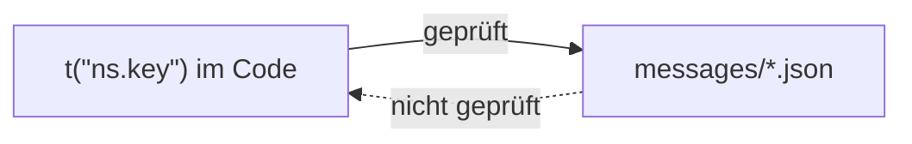
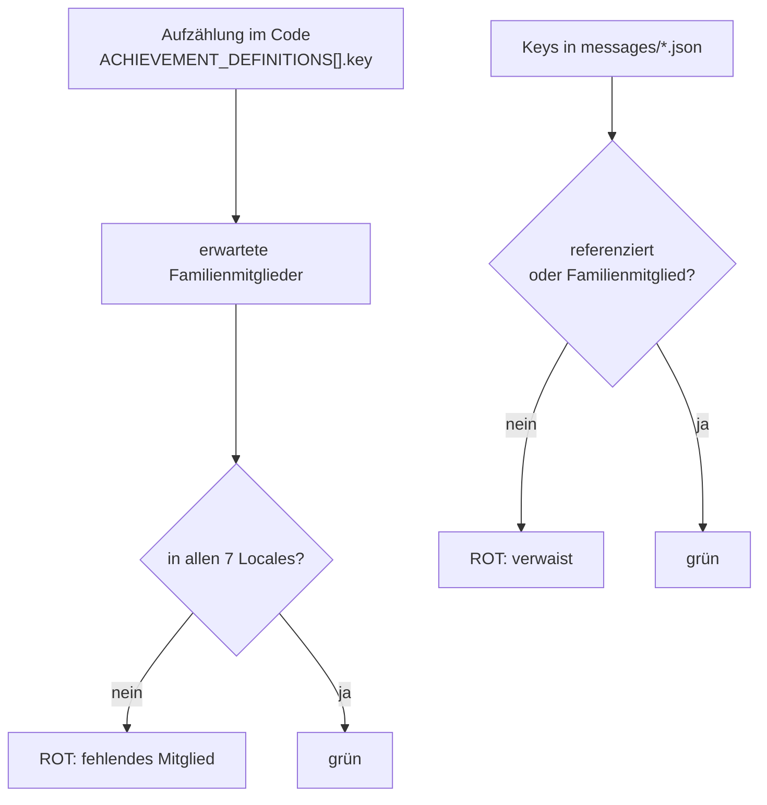
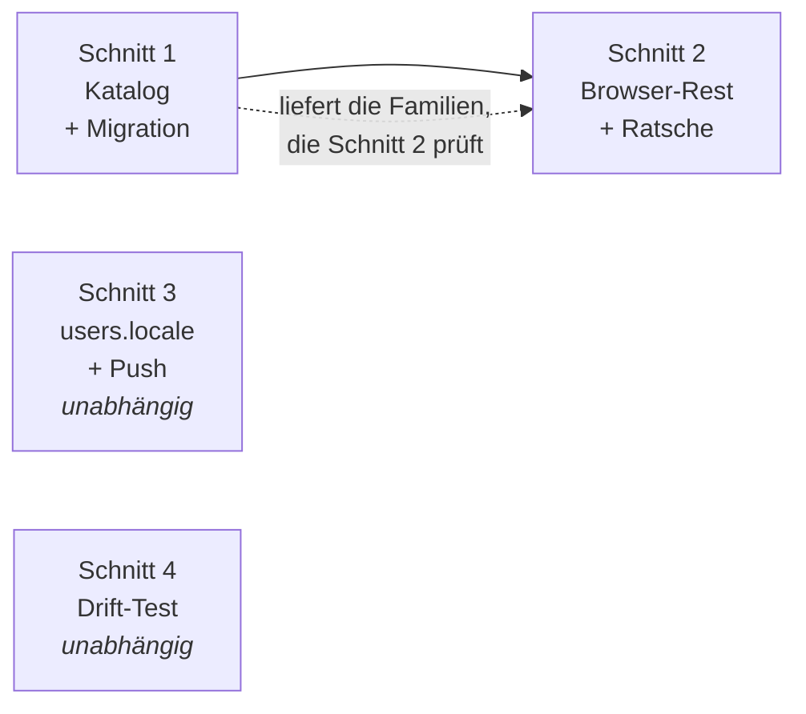

# Das Versprechen der Mehrsprachigkeit einlösen

**Datum:** 2026-09-02 · **Status:** Spec, freigegeben · **Umsetzung:** vier Schnitte, vier PRs

Momo liefert sieben Locale-Dateien mit 456 KB Übersetzung aus und zeigt einer
französischen Nutzerin ein deutsches Nutzermenü, einen deutschen
Errungenschaftskatalog und deutsche Push-Benachrichtigungen. Diese Spec schließt
die Lücke und baut die Ratsche, die sie zuhält.

Der Anlass ist ein Termin: awesome-selfhosted-Eligibility am **22.09.2026**. Die
Roadmap argumentiert, ein Listing, das Besucher auf ein Repo mit 36 High-Alerts
schickt, sei schlechter als kein Listing. Dasselbe gilt für eine App, die sieben
Sprachen behauptet und in der ersten Minute Deutsch zeigt.

---

## Gemessener Bestand

Alle Zahlen am 2026-09-02 gegen `main` (`abd0c07`) erhoben, nicht aus der
Roadmap übernommen.

| Fläche | Literale | Keys × 7 Locales |
| --- | --- | --- |
| `lib/gamification.ts` — 31 Errungenschaften × Titel/Beschreibung | 62 | 434 |
| `lib/push.ts` — Payload-Titel und -Bodies | 22 | 154 |
| `lib/gamification.ts` — `LEVELS` | 10 | 70 |
| `components/layout/user-menu.tsx` | 5 | 35 |
| `{n}d`-Suffix (3 Stellen, 1 Key), `streak-sparkline.tsx:60` | 2 | 14 |
| | **~101 Keys** | **~707 Strings** |

`lib/notifications.ts` (E-Mail, 572 LOC) enthält **null** deutsche Literale.
Dort ist nichts zu tun.

### Zwei Korrekturen an der Roadmap

**Das OpenAPI-Drift-Skript existiert nicht.** Die Roadmap schreibt, ein
~40-zeiliges Skript aus der 0.6.0-Phase „muss nur noch in `__tests__/`
einziehen". `scripts/` enthält `check-design-tokens.mjs`, `check-i18n.mjs`,
`migrate.mjs` — sonst nichts. Das Skript war Wegwerfcode. Schnitt 4 ist echtes
Schreiben.

**Die Drift-Zahl war in der falschen Einheit.** Die Roadmap nennt „42 von 67
API-Routen dokumentiert" und vermischt damit Pfade mit Routen. Die ehrliche
Einheit ist dieselbe, die `__tests__/api-rate-limits.test.ts` gelernt hat — der
Handler:

| Einheit | Vorhanden | Dokumentiert | Lücke |
| --- | --- | --- | --- |
| Dateien `app/api/**/route.ts` | 67 | — | — |
| Pfade in `lib/openapi.ts` | — | 42 | — |
| **Handler / Operationen** | **97** | **67** | **30** |

97 exportierte Handler (38 POST, 27 GET, 16 DELETE, 14 PATCH, 2 PUT) gegen 67
dokumentierte Operationen. Die Lücke ist 30, nicht 25. Genau dieser Fehler —
pro Datei statt pro Handler zählen — verdeckte bei der Rate-Limit-Arbeit zwei
ungeschützte Handler.

---

## Der Kern: wo Anzeigetext lebt

Die 62 deutschen Errungenschaftsliterale stehen nicht nur im Code. Sie werden
per Upsert **in die Datenbank jeder Instanz geschrieben** und von dort gelesen:

```
lib/gamification.ts:837  seedAchievements()  ── upsert ──▶  achievements.title
                                                            achievements.description
                                                                  │
                        ┌─────────────────────────────────────────┤
                        ▼                     ▼                   ▼
              lib/statistics.ts        lib/export.ts        lib/push.ts
              (4 Lesestellen)          (DSGVO-Export)       (1232, 1459)
```

**Entscheidung:** Die Tabelle hält nur noch den `key`. Anzeigetext lebt
ausschließlich in `messages/*.json`.

| | Vorher | Nachher |
| --- | --- | --- |
| `achievements.title` | `text notNull` | **entfernt** |
| `achievements.description` | `text notNull` | **entfernt** |
| `ACHIEVEMENT_DEFINITIONS[].title` | deutsches Literal | **entfernt** |
| `ACHIEVEMENT_DEFINITIONS[].description` | deutsches Literal | **entfernt** |
| Anzeige | DB-Spalte | ``t(`${key}.title`)`` |

`ACHIEVEMENT_DEFINITIONS` verliert die Felder ebenfalls — bleiben sie stehen,
gibt es zwei Wahrheiten und die Locale-Dateien sind die zweite.

### Der DSGVO-Export bleibt lesbar

`lib/export.ts:204-205` behält `title` und `description`, übersetzt sie aber
zur Exportzeit aus `users.locale`. Ein Export ist ein nutzersichtbares
Artefakt; ihn wortlos auf Keys zu reduzieren wäre eine stille
Verschlechterung.

---

## Das Rückgrat: die Ratsche

``t(`${achievement.key}.title`)`` ist ein dynamischer Key, und
`scripts/check-i18n.mjs` scannt Literale. Ohne Gegenmaßnahme meldet die neue
Gegenrichtung alle 62 Errungenschafts-Keys als verwaist — das ist exakt das
Template-Literal-Problem, das die Roadmap mit 132 falsch-positiven Kandidaten
beschreibt.

Das Skript prüft heute **eine** Richtung:



Es bekommt zwei Erweiterungen, nicht eine:

| Erweiterung | Regel |
| --- | --- |
| **Gegenrichtung** | Ein Key in `messages/*.json` ohne Code-Referenz ist rot |
| **Key-Familien** | Eine deklarierte Familie nennt ihr Präfix und die codeseitige Aufzählung, die ihre Mitglieder erzeugt |

Deklarierte Familien für diese Spec:

| Familie | Aufzählung | Mitglieder |
| --- | --- | --- |
| `achievements.<key>.title` / `.description` | `ACHIEVEMENT_DEFINITIONS[].key` | 62 |
| `levels.<n>.title` | `LEVELS[].level` | 10 |

Eine Familie ist **stärker** als ein Literal-Scan, nicht schwächer:



Dieselbe Mechanik entschärft `closure.quote_${n}`, `templates.<x>.task_N` und
`progress.tab_${id}` — **ohne eine einzige Löschung auf Verdacht.** Die Roadmap
warnt ausdrücklich davor, und eine falsche Löschung ist genau das, was das
heutige Skript nicht bemerken würde.

---

## Serverseitig: `users.locale` wird echt

Heute widersprechen sich zwei Dokumente über dieselbe Spalte:

| Ort | Aussage | Wahr? |
| --- | --- | --- |
| `lib/db/schema.ts:151-156` | „sent in the user's language. Updated whenever the locale cookie is set." | **nein** |
| `lib/push.ts:402-406` | „no per-user i18n in cron jobs — there's no request locale" | ja |

`app/api/locale/route.ts:54` setzt den Cookie und schreibt die Spalte nicht.
Niemand liest sie. Die Spalte ist tot, und der Schema-Kommentar behauptet das
Gegenteil — dieselbe Fehlerklasse, die die Roadmap dreimal als schlimmer als
eine undokumentierte Lücke bezeichnet.

**Entscheidung:** Der Kommentar wird wahr gemacht, nicht gestrichen.

| Änderung | Ort |
| --- | --- |
| `UPDATE users SET locale` beim Cookie-Setzen | `app/api/locale/route.ts` |
| Payload-Builder nehmen eine Locale | `lib/push.ts` (7 Builder) |
| `getTranslations({locale, namespace})` aus `next-intl/server` | ebenda |
| Fallback | `users.locale ?? DEFAULT_LOCALE` |

`next-intl` 4.13.7 exportiert `getTranslations` serverseitig — verifiziert, kein
Neubau.

**Bewusst hingenommen:** Bestandsnutzer haben `locale = null`. Es gibt keine
Datenquelle für einen Backfill — der Cookie liegt im Browser, nicht in der DB.
Sie lesen weiter Deutsch, bis sie einmal die Sprache umstellen. Das ist eine
Entscheidung, keine Auslassung.

---

## Der Drift-Test

Neu geschrieben nach dem Muster von `__tests__/api-rate-limits.test.ts`: läuft
über `app/api/**/route.ts`, zerlegt jede Datei in Handler-Regionen, prüft **pro
Handler**.

Drei Prüfungen mit absichtlich unterschiedlicher Schärfe:

| Prüfung | Bestand heute | Verhalten |
| --- | --- | --- |
| Tote `$ref`s | 0 | rot bei der ersten |
| Geister-Operationen (dokumentiert, existiert nicht) | 0 | rot bei der ersten |
| Undokumentierte Handler | **30** | die 30 werden **exakt gepinnt** |

Das Pinnen ist der Zweck. Zwei der drei Prüfungen stehen heute auf null und
dürfen deshalb sofort scharf sein. Die dritte steht auf 30 — sie heute rot zu
schalten hieße, 30 Operationen nachzudokumentieren, was diese Spec nicht will.
Stattdessen wird die Menge festgenagelt: **die 31. undokumentierte Operation
macht den Test rot.** Die Liste kann nur schrumpfen.

Die Roadmap belegt, dass sich das lohnt: während der Härtungsarbeit versprach
die Spec ein `429` auf einer Route ohne Limit und enthielt zwei tote `$ref`s
auf eine `RateLimited`-Komponente, die nie existiert hat. Beides fand kein
Test, sondern ein Mensch.

---

## Die vier Schnitte

Eine Spec, vier Pläne — weil sie vier unabhängige Rot-Zustände haben.



| # | Inhalt | Migration | Abhängig von |
| --- | --- | --- | --- |
| 1 | Katalog: Migration, `seedAchievements()`, 6 Lesestellen, 31 Errungenschaften + 10 Level × 7 | **ja** | — |
| 2 | `user-menu`, Sparkline-aria, `{n}d`-Key, `check:i18n` Gegenrichtung + Familien | nein | 1 (liefert die Familien) |
| 3 | `users.locale` schreiben/lesen, 22 Push-Payloads × 7 | nein | — |
| 4 | `__tests__/openapi-drift.test.ts` | nein | — |

Schnitt 1 zuerst, weil er die einzige Migration trägt und die Key-Familien
erzeugt, gegen die Schnitt 2 prüft. 3 und 4 sind von beiden unabhängig.

---

## Benennung: die Level-Titel sind Michael Ende

Die zehn `LEVELS`-Titel sind keine Produktsprache. „Grauer-Herren-Besieger"
verweist auf die *Grauen Herren* aus Michael Endes *Momo*, dem Buch, das dem
Projekt den Namen gibt.

**Entscheidung:** Der Bezug wird in allen sieben Sprachen gehalten, nicht
wörtlich übersetzt — die etablierten Übersetzungen des Romans liefern die
Entsprechungen (englisch „the men in grey"). Ein wörtlich übersetzter Titel
verliert genau die Anspielung, die er trägt.

---

## Was bewusst nicht passiert

| | Grund |
| --- | --- |
| Kein Backfill von `users.locale` | keine Datenquelle; der Cookie liegt im Browser |
| Keine Übersetzung von Aufgaben-/Themen-Inhalten | das sind Nutzerdaten, nicht Oberfläche |
| Die 30 undokumentierten Operationen werden nicht nachdokumentiert | der Test nagelt sie fest, statt sie zu erzwingen |
| Kein Anfassen von `lib/notifications.ts` | null deutsche Literale |
| Keine Löschung verwaister Keys auf Verdacht | die Familien-Mechanik entscheidet, nicht ein Nachscan |
| **Keine automatische Wache gegen _neues_ hartkodiertes Deutsch** | siehe unten |

### Die Grenze der Ratsche

`check:i18n` bewacht **Keys**, nicht **Literale**. Ein neuer deutscher String,
der nie durch `t()` geht, bleibt für das Skript unsichtbar — genau deshalb
standen die fünf `user-menu.tsx`-Labels jahrelang unbemerkt da.

Ein Umlaut-Scan wäre keine Abhilfe. Von den fünf Labels — `Statistiken`,
`Wochenrückblick`, `Einstellungen`, `Admin`, `Abmelden` — trägt genau **eines**
einen Umlaut. Ein solcher Scan hätte eines von fünf gefunden und dabei den
Anschein einer Wache erzeugt. Diese Spec baut ihn deshalb nicht.

Was nach Schnitt 2 gilt: die benannten Stellen sind behoben und ihre Keys
sind bewacht. Was nicht gilt: dass die nächste hartkodierte Zeile auffällt.
Das ist eine offene Flanke und steht als solche hier, nicht als erledigt.

---

## Abnahme

| Kriterium | Prüfung |
| --- | --- |
| Die fünf benannten `user-menu.tsx`-Labels gehen durch `t()` | grep auf die Datei: null nackte Textknoten |
| Kein verwaister und kein fehlender Key | `check:i18n` grün in beiden Richtungen |
| Errungenschaften und Level in 7 Sprachen | Familien-Prüfung: 72 Mitglieder × 7 vorhanden |
| Push in der Sprache der Nutzerin | Test mit `users.locale = "fr"` erwartet französischen Payload |
| `achievements.title` existiert nicht mehr | Migration angewandt, `tsc --noEmit` grün |
| Kein toter `$ref`, kein Geist | `openapi-drift.test.ts` grün |
| Die 31. undokumentierte Operation ist rot | Test mit einer erfundenen Route |
