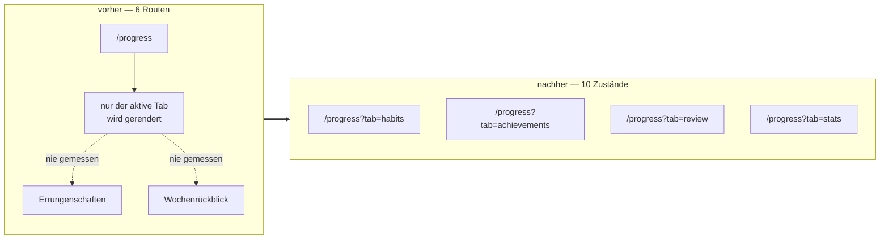

# Lichtkegel Phase 2 — Abschluss

Abgeschlossen am 2026-08-28 auf `design/lichtkegel-phase2`. Diese Seite hält fest,
**was sich geändert hat** und **warum die interessanten Entscheidungen so gefallen
sind**. Die Zustandsmessung dahinter steht in `zustandspruefung.md`, die offenen
Punkte in `ROADMAP.md` („Aus der Lichtkegel-Phase 2").

## Der Fund, der die Phase umgestellt hat

Die Phase war als Seitenmigration geplant. Beim ersten Messen stellte sich heraus,
dass zwei von drei `/progress`-Tabs nicht *unmigriert*, sondern **unmessbar** waren:
die Zähler kannten Routen, `ProgressTabs` rendert aber nur den aktiven Tab.

Der Rückblick-Tab trug **drei Amber**, wo die Regel eins erlaubt — und kein Test war
rot. Die Messeinheit war die Ursache, nicht der Tab. `MIGRATED_PAGES` zählt seither
**Zustände**: `/dashboard`, `/tasks`, `/focus`, `/topics`, `/progress` und dessen drei
weitere Tabs, `/wishlist`, `/quick`.

## Prüfungen

| Prüfung | Kriterium | Ergebnis |
|---|---|---|
| `npm run check:design` | Baseline gefallen, mit `--update` festgeschrieben | **1938 → 1547** Verstöße, **111 → 98** geführte Dateien |
| `npm run check:i18n` | grün über sieben Locales (neu: `progress.tab_stats`, `wishlist.budget_total_spent`) | grün, 1033 Referenzen |
| `npx tsc --noEmit` | strict, kein `any` | grün |
| `npm run test` | Vitest | **1741 / 1741** |
| `e2e/design-rules.spec.ts` | zehn Zustände × zwei Themes × fünf Regeln | **100 / 100 grün** (isoliert und im Vollauf) |
| `npx playwright test` (voll) | ganze Suite gegen `next dev` | 275 grün, 47 rot — s. u. |
| Chrome-Review | beide Themes, 1440 px und 375 px, zwölf Ansichten | ohne Regelverstoß, drei Beobachtungen (u.) |
| README-Screenshots | `04-stats.png`, `05-wishlist.png` neu, 1440×900, dunkel, Locale `en` | neu |

**Die 47 roten E2E-Tests sind keine Regression dieser Phase.** Aufgeschlüsselt nach
Fehlermeldung: **15** sind `not.toContainText(/500/i)` — die Kollision mit
Produktdaten, die `ROADMAP.md` beschreibt. Die übrigen 32 kommen aus dem
Entwicklungsserver, gegen den die Suite hier lief: `dev.log` enthält
`ChunkLoadError: Loading chunk app/layout failed`,
`Router action dispatched before initialization` und 18 Hydrations-Mismatches — die
üblichen Artefakte einer 19-Minuten-Suite gegen `next dev` mit On-Demand-Kompilierung.
Die 100 Designregel-Tests sind in beiden Läufen grün, isoliert wie im Vollauf.

`--admit` wurde nicht gebraucht. Das `--update` senkte die Baseline um die letzten
18 Einheiten Scheinluft: `app/(app)/quick/page.tsx` und
`components/quick/five-minute-view.tsx` standen nach Task 7 auf 0 und fielen ganz aus
der Liste — daher 98 statt 100 geführte Dateien.

## Die zwei offenen Punkte der Spec

**§9 — die drei Wunschlisten-Zählwerte.** *Entscheidung: keine Änderung.* Alle drei
Zahlen stehen bereits auf `/wishlist`, nur nicht als Kachelreihe: die offenen Wünsche
sind die Liste selbst, der Umschalter nennt „History (1)", und im aufgeklappten
Verlauf trägt die verworfene Gruppe ihre eigene Überschrift mit Zahl. Die vorgesehene
Mono-Zeile hätte eine vierte Stelle für dieselben Zahlen geschaffen. Die
Gesamtausgaben — die einzige Zahl, die *nicht* abzählbar war — stehen jetzt in der
Budgetleiste im Rand.

**§12 — der 6-px-Themenpunkt.** *Bewertung: behalten, aber sichtbar machen.* Nach
Phase 2 erscheint er in sechs Komponenten (`task-row`, `topic-card`, `topics-grid`,
`habit-card`, `focus-mode-view`, `stats-tab`) und damit auf sieben der zehn
gemessenen Zustände. Er ist als `h-[6px] w-[6px]` geschrieben, also **kein
Abstands-Utility** — die vierte Ratschenkategorie prüft nur `p-`/`m-`/`gap-`/`space-`
(`scripts/check-design-tokens.mjs:112-118`) und sieht ihn nicht. 6 px ist damit kein
Verstoß, den jemand übersehen hat, sondern eine Größe, die außerhalb jeder Skala
lebt. Die Entscheidung lautet: 6 als Punktgröße in die Spec aufnehmen oder auf 8
gehen — beides eine eigene Aufgabe, nicht dieser Abschluss.

> Ein visueller A/B war auf dem geteilten Testkonto nicht möglich: **kein Thema dort
> trägt eine Farbe**, der Punkt rendert also gar nicht. Die Bewertung stützt sich auf
> Code und Verbreitung, nicht auf einen Screenshot.

## Chrome-Review, zwölf Ansichten × zwei Themes

| Ansicht | Ergebnis |
|---|---|
| `/progress?tab=habits` | Inhalt unverändert; **Kopf springt** (s. u.) |
| `/progress?tab=review` | Rand steht mit fünf Zeilen; leere Woche nicht herstellbar (Konto hat Abschlüsse) |
| `/progress?tab=achievements` | Seltenheit als Gruppenüberschrift mit Bruch trägt die 31 Zeilen; keine Wand |
| `/progress?tab=stats` | sieben Randzeilen bei 1440 px, gestapelt bei 375 px |
| `/progress?tab=stats` (Diagramme) | Sparkline, Wochentage, Energie-Rampe: ohne Kasten als Einheiten lesbar, weil jede eine Mono-Augenbraue trägt |
| `/wishlist` mit Wünschen | Preis rechts in Mono liest sich als Preis; Betrag und Titel stehen in derselben Zeile |
| `/wishlist` leer | `EmptyState`, kein gestrichelter Kasten |
| `/wishlist` ohne Treffer | derselbe `EmptyState`, plus „0/7 Clear filters" im Rand |
| `/wishlist` über Budget | trägt ohne Rot: gefüllter Balken, „over budget" statt „€X left", pro Zeile „✕ OVER BUDGET". Reicht. |
| `/quick` mit Aufgaben | `TaskRow`, identisch zu `/tasks` |
| `/quick` leer | nicht herstellbar — das Konto hat 8 Aufgaben ≤ 5 min |
| `/wishlist` bei 375 px | Titel brechen innerhalb des Worts, Augenbraue kürzt („✓ AFF…"); lesbar, eng |

Drei Beobachtungen, keine davon ein Regelverstoß:

- **Der Seitenkopf springt zwischen den Tabs.** Zwei der vier Tabs können randlos
  sein — `habits-tab.tsx` (`rail={undefined}`, sobald alle Randsummen 0 sind,
  dokumentiert in `habits-tab.tsx:279-296`) **und** `review-tab.tsx:94`
  (`const rail = !hasRail ? undefined : (`), aus demselben Grund: keine leere
  Randspalte, an der fünf Designregeln vorbeimessen. `achievements-tab.tsx` und
  `stats-tab.tsx` bauen ihren Rand dagegen unbedingt und sind immer gerandet.
  `page-frame.tsx:57-60` zentriert (`mx-auto`) eine `max-w-[var(--measure)]`-Spalte
  ohne Rand und eine `max-w-[calc(measure+gutter+rail)]`-Spalte mit Rand — beide
  für sich korrekt, aber verschieden breit, sodass „Progress" samt Tableiste um
  ~128 px verspringt. Auf einem frischen Konto (keine Habit-Abschlüsse, keine
  Review-Aktivität) trifft das **drei von vier Tab-Wechseln** — den
  Standard-Erstlauf durch die Tableiste, kein Randfall. Der Preis dieser
  Entscheidung war nicht mitgewogen.

  `PageFrame` je Tab statt auf Seitenebene zu hoisten ist keine dritte Option:
  jeder Tab holt seine Randdaten inzwischen selbst (siehe `habits-tab.tsx`s
  eigener Kommentar zur Aufgabe, die diese Trennung erst nötig machte), ein
  gemeinsamer `PageFrame` auf Seitenebene müsste wieder alle vier Datenquellen
  vorab laden. Entscheidung bleibt: festhalten, nicht beheben.
- **Der amber Fokusring ist im Screenshot sichtbar** — das Suchfeld auf `/wishlist`
  trägt ihn deutlich. Fund 1 der Zustandsprüfung, drei Gatter blind dafür.
- **Der Errungenschaftskatalog ist hartkodiert deutsch.** Bei Locale `en` steht dort
  „Erstes Wunschlisten-Item gekauft" — `lib/gamification.ts` hält Titel und
  Beschreibung als Literale, sie laufen nie durch `t()`. Dieselbe Blindstelle wie im
  Benutzermenü, eine Ebene tiefer.

## Was die Phase bewegt hat

| | |
|---|---|
| Ratsche | 1938 → 1547 Verstöße |
| Zeilen in `app/`, `components/`, `lib/` | +2005 / −3649, netto **−1644** |
| `/stats` | 834 Zeilen → 6-Zeilen-Weiterleitung; Inhalt als `tabs/stats-tab.tsx` |
| `/review` | Weiterleitung |
| `progress-tabs.tsx` | 597 Zeilen → ~40-Zeilen-Verteiler plus vier Tab-Dateien mit eigenem `PageFrame` |
| `wishlist-card.tsx` | 667 Zeilen → `wishlist-row.tsx` + `wishlist-row-actions.tsx` |
| `achievement-card.tsx` | 242 Zeilen → `achievement-row.tsx` |
| neue i18n-Keys | zwei, wie budgetiert |

## Eine bewusst hingenommene Lücke: `/quick` zeigt keinen Münzwert mehr

Task 7 tauschte `TaskItem` gegen `TaskRow`. Auf `/tasks` ist das korrekt: der
Münzwert zieht in `tasks-rail.tsx` um (siehe `task-row.tsx:16`). `/quick`
(`app/(app)/quick/page.tsx`) rendert aber ein randloses `PageFrame` — für den
Münzwert gibt es dort kein Ziel. Er wird weiter serialisiert
(`components/quick/five-minute-view.tsx:38`) und nur noch vom
Undo-Refund-Pfad gelesen (`:133-134`), aber nirgends mehr angezeigt: eine
Zahl, die vor dieser Phase sichtbar war, ist es jetzt auf `/quick` nirgends.
Sie fiel zwischen Task 7s Zuschnitt („Consumer tauschen") und Task 1/6s
Zuschnitt („den Rand bauen") — niemand besaß sie.

**Entscheidung: Verlust bewusst hingenommen, kein `/quick`-Rand in dieser
Phase.** Ein Rand dort wäre neue Entwurfsfläche am Phasenende, ohne
Spec-Deckung und nach dem letzten Review — und die Zahl existiert weiterhin
auf `/tasks`. In `ROADMAP.md` nachgetragen: ein `/quick`-Rand mit der
Münzsumme der Session als naheliegender Ort für die Wiederherstellung.

## Was offen bleibt

Elf Funde außerhalb jedes Task-Zuschnitts stehen in **`ROADMAP.md`** unter
„Aus der Lichtkegel-Phase 2" — Testinfrastruktur, drei Löcher in der Messung selbst,
zwei i18n-Richtungen, drei Kleinigkeiten. Der Schlussreview des ganzen Branches hat
dort denselben Abschnitt um den Kopfzeilen-Sprung (oben), den Budget-Widerspruch, die
`/quick`-Entscheidung und sechs weitere Kleinigkeiten ergänzt. Die Messgrundlage zu
den ursprünglichen elf steht in `zustandspruefung.md`.

Der wichtigste davon in einem Satz: **die Ratsche liest kein CSS**, die Suite
interagiert nie, und die Phasen sind nach Seiten geschnitten, während die Verstöße in
Formularen, Menüs und einem globalen Fokusstil sitzen. „1547 Verstöße, keiner neu"
ist eine Aussage über `.tsx`-Dateien im Ruhezustand — nicht über die Oberfläche.
