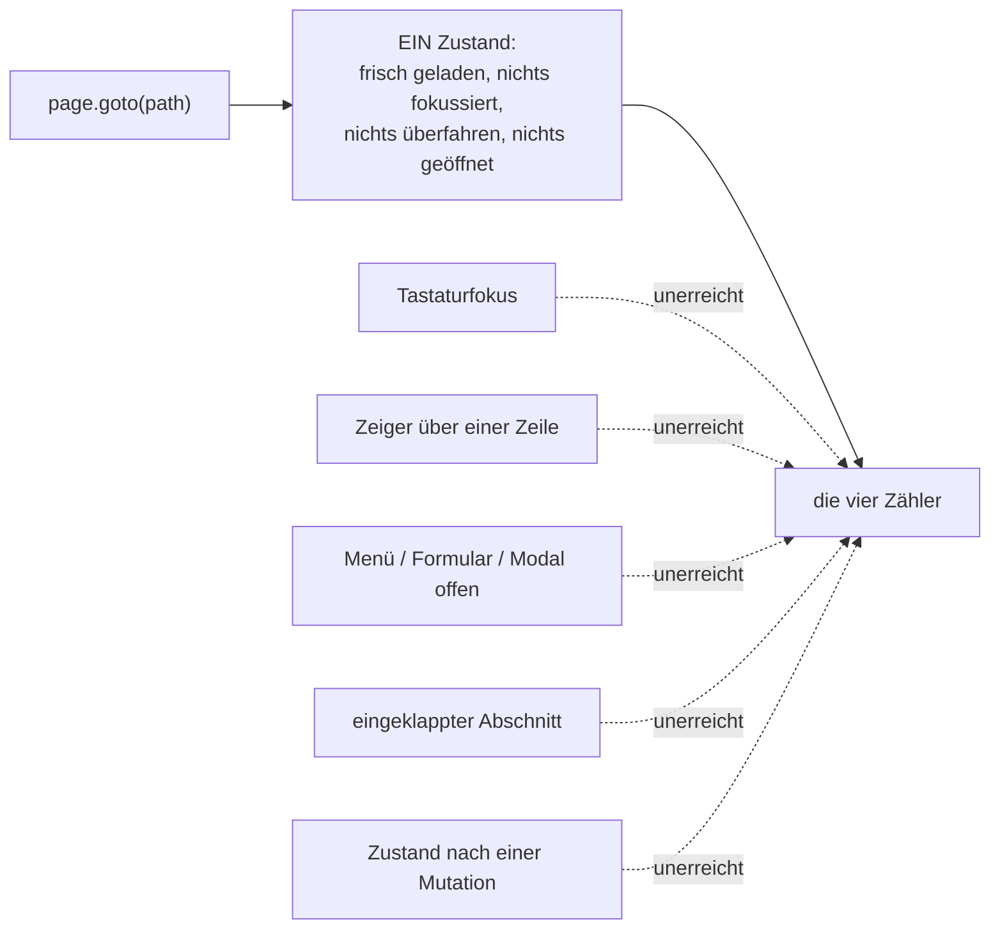

# Nachprüfung der Phase-1-Seiten in ihren Zuständen

Gemessen am 2026-08-28, Anlass: Spec Phase 2 §5. Die Phase-1-Zähler haben jede
Seite in genau **einem** Zustand gesehen — dem, den `page.goto(path)` herstellt.
Diese Prüfung fragt, ob unter den anderen Zuständen dasselbe liegt wie unter
`/progress`' zwei ungemessenen Tabs.

Instrumente: `countAmber`, `countDisplayFont`, `countBoxes`, `measureColumns`,
`gotoWithTheme` — dieselben wie `e2e/design-rules.spec.ts`, gefahren aus einer
Wegwerf-Sonde (`e2e/zustandssonde.spec.ts`, nach dem Lauf gelöscht: eine Spec,
die nur misst und immer grün ist, wäre ein Test, der nichts behauptet).
Viewport 1440×900, beide Themes, Konto `e2e@momotest.local`, Locale `en`.
**Beide Themes lieferten überall identische Zahlen** — mit einer Ausnahme
(`/topics` · Themenformular: 4 dark / 3 light, der Unterschied ist ein
Farbfeld-Button, dessen Nutzerfarbe nur im Dunkelschema in die Amber-Toleranz
fällt). Die Tabelle führt deshalb eine Zeile je Zustand, nicht je Zustand×Theme.

## Warum die Lücke dieselbe ist, eine Ebene tiefer

`e2e/design-rules.spec.ts` und `e2e/helpers/design-count.ts` enthalten **kein**
`click`, `hover`, `press`, `focus` oder `fill` (per grep verifiziert).
`gotoSettled` navigiert und wartet auf `opacity: 1`, mehr nicht. Alles, was erst
durch eine Interaktion entsteht, ist damit nicht ungeprüft-und-in-Ordnung,
sondern **unmessbar** — dieselbe Kategorie wie `/progress`' zwei inaktive Tabs.

## Ergebnis

Regeln: Amber `außerhalb ≤ 0` bei vorhandenem Lichtkegel, sonst `≤ 1`; Fraunces
in `main` genau `1`; Kästen in `main` `0`; mindestens eine `[data-column]`,
keine breiter als `--measure`, kein unbenannter Überlauf.

| Zustand | erreichbar per `goto`? | Amber | Fraunces | Kästen | Spalten | Verdikt |
|---|---|---|---|---|---|---|
| `/dashboard` · Standard | ja | 2 (beide im Licht) | 1 | 0 | 1 | ok |
| `/dashboard` · Energie-Picker offen | nein | 2 (im Licht) | 1 | 0 | 1 | ok |
| `/dashboard` · Aufschlüsselungs-Modal | nein | 2 (im Licht) | 1 | 0 | 1 | ok |
| `/dashboard` · 5× Tab (Tastaturfokus) | nein | **3** (1 außerhalb) | 1 | 0 | 1 | **Amber** |
| `/tasks` · Standard | ja | 1 | 1 | 0 | 1 | ok |
| `/tasks` · Prioritätsfilter aktiv | nein | 1 | 1 | 0 | 1 | ok |
| `/tasks` · Nach Thema gruppiert | nein | 1 | 1 | 0 | 1 | ok |
| `/tasks` · Pausiert + Erledigt aufgeklappt | nein | 1 | 1 | 0 | 1 | ok |
| `/tasks` · Zeile mit Zeiger überfahren | nein | 1 | 1 | 0 | 1 | ok |
| `/tasks` · Auswahlmodus, nichts gewählt | nein | 0 | 1 | 0 | 1 | ok |
| `/tasks` · Auswahlmodus, 1 Zeile gewählt | nein | 1 | 1 | **1** | 1 | **Kasten** |
| `/tasks` · Suche ohne Treffer (Feld fokussiert) | nein | **2** | 1 | 0 | 1 | **Amber** |
| `/tasks` · 8× Tab (Tastaturfokus) | nein | **2** | 1 | 0 | 1 | **Amber** |
| `/tasks` · Snooze-Menü offen ᴴ | nein | **2** | 1 | 0 | 1 | **Amber** |
| `/tasks` · Formular „Neue Aufgabe" offen | nein | **5** | **2** | **2** | 1 | **Amber, Fraunces, Kästen** |
| `/topics` · Standard | ja | 1 | 1 | 0 | 1 | ok |
| `/topics` · Karte mit Zeiger überfahren | nein | 1 | 1 | 0 | 1 | ok |
| `/topics` · Vorlagenwähler offen | nein | **11** | 1 | 0 | 1 | **Amber** |
| `/topics` · Themenformular (Bearbeiten) ᴴ | nein | **4** / 3 | 1 | 0 | 1 | **Amber** |
| `/topics/[id]` · Detailseite | Route steht in keiner Liste | **6** | **2** | **5** | **0** | **alle vier** |
| `/focus` · Auswahlphase | ja | 1 | 1 | 0 | 1 | ok |
| `/focus` · Arbeitsphase | nein | 1 | 1 | **1** | 1 | **Kasten** |
| `/focus` · Schlussphase | nein | 1 | 1 | 0 | 1 | ok |

ᴴ **Nur mit erzwungenem `hover()` erreichbar.** Ohne Hover bleibt der
Auslöser `opacity-0` + `pointer-events-none` (Fund 11) und der Klick läuft in
einen Timeout: der Snooze-Auslöser meldete dann 1 Amber statt 2, das
Themenformular 1 statt 4/3. Diese zwei Zeilen sind also nur zu haben, indem man
die Gatterung besiegt, die selbst ein Fund ist.

Vier Zustände sind per `goto` erreichbar und grün — genau die, die schon
gemessen wurden. **Von 19 Zuständen dahinter sind 10 rot.**

## Zustände, die auch die Sonde nicht herstellen konnte

| Zustand | warum nicht |
|---|---|
| `/topics` · Archiv aufgeklappt | das Testkonto hat kein archiviertes Thema — der Abschnitt rendert gar nicht |
| `/dashboard` · Quest erledigt, Level-Up, Achievement-Toast | erfordert `POST /complete`, mutiert das geteilte Testkonto |
| `/dashboard` · Empty-State „neuer Nutzer" | erfordert ein Konto mit 0 Themen und 0 Abschlüssen |
| `/tasks` · Empty-State, Wisch-Vorschau | Konto hat Aufgaben; Wischen braucht Touch-Events |
| `/focus` · Empty-State, `completionError` | erfordert 0 offene Aufgaben bzw. einen Netzfehler |

Diese Zustände sind **weder geprüft noch als geprüft vermerkt** — die gleiche
Kategorie wie `/topics/[id]`, nur ohne eigene Route.

## Die Funde

Zwölf. Die Kurzfassung scannt; was einen Satz braucht, steht als Fußnote
darunter.

| # | Fund | Datei | Regel | Zuordnung | behoben? |
|---|---|---|---|---|---|
| 1 | amber Fokusindikator (`outline` + Halo) ¹ | `app/globals.css:541-547` | Amber | keine | nein |
| 2 | `countAmber` liest kein `outline-color` ² | `e2e/helpers/design-count.ts` | Zählerlücke | Phase 2 | nein, s. u. |
| 3 | `::selection` mit amber Fläche | `app/globals.css:555-558` | Amber als Fläche | keine | nein |
| 4 | Eingabefeld-Fokusring amber | `components/ui/input.tsx:18` | Amber | keine | nein |
| 5 | Aufgabenformular: Panel, Backdrop, 2. Fraunces, Amber-Fläche ³ | `components/tasks/task-form.tsx:325, 890, 279-285, 469-471` | Amber, Fraunces, Kästen | keine | nein |
| 6 | Themenformular: Amber als Button-Fläche | `components/topics/topic-form.tsx:502, 345-350, 391-396` | Amber | keine | nein |
| 7 | Vorlagenwähler: Badge „In order" amber getönt, 11 Treffer | `components/topics/template-picker.tsx:149-150, 214` | Amber als Fläche | keine | nein |
| 8 | Massenaktionsleiste: umrahmter Kasten in `main` | `components/tasks/bulk-action-bar.tsx:85, 93` | Kästen | keine | nein |
| 9 | `/focus` Fortschritts-Pip zählt als gefüllte Fläche ⁴ | `components/focus/focus-mode-view.tsx:274-283` | Kästen | keine ⁷ | nein |
| 10 | `/topics/[id]` verletzt alle vier Regeln, steht in keiner Liste ⁵ | `components/topics/topic-detail-view.tsx:228, 344, 398-399`, `task-item.tsx` | alle vier | Phase-1-Rest / keine | nein |
| 11 | `Row`s `actions` sind `opacity-0` bis Hover/Fokus ⁶ | `components/ui/list.tsx:374-393` | Messlücke | Phase 2 | nein, geprüft und leer |
| 12 | `border-radius: 4px` — außerhalb der vier Radius-Stufen | `app/globals.css:544` (Stufen: `:58-61`) | Radius | keine | nein |

„keine" = in keiner Phasenliste der Spec §7. Siehe den übernächsten Abschnitt.

¹ `outline: 2px solid var(--accent-amber)` plus ein 6-px-`box-shadow`-Halo.
Sobald irgendetwas Fokus hat, trägt jede Seite ein Amber mehr — auch ein
Radix-Menü, das sich beim Öffnen selbst fokussiert. Funde 1 und 12 sind
derselbe `:focus-visible`-Block, zwei verschiedene Regeln.

² Gelesen werden `color`, `background*`, `box-shadow`, `fill`, `stroke`,
`border-*`, `::before/::after`. Fund 1 wird deshalb **nur über sein Halo**
sichtbar; ohne den `box-shadow` wäre er es gar nicht.

³ Kein `role="dialog"` am Panel, also greift die Overlay-Ausnahme von
`countBoxes` nicht: Panel-Rahmen und Backdrop-Fläche zählen beide in `main`.
Dazu ein zweites Fraunces (`h2` „New Task") und Amber als Button-**Fläche**
(`backgroundColor: var(--accent-amber)`), was die Spec ausdrücklich verbietet.

⁴ Der aktive Pip ist `h-2 w-6` mit `bg-[var(--ink)]` — 24 px breit, also über
der 12-px-Punkt-Schwelle, und ohne `role="progressbar"`, also ohne die
Fortschritts-Ausnahme.

⁵ 6 Amber, 2 Fraunces, 5 Kästen, **0 `[data-column]`**. Die Route steht in
keiner `MIGRATED_PAGES`-Liste und rendert über `topic-detail-view.tsx` das alte
`TaskItem` — weder migriert noch als unmigriert vermerkt.

⁶ Nur unter `@media (hover: hover)`. Betrifft jede Zeilenaktion auf `/tasks`,
`/topics`, `/focus`, `/quick`, `/wishlist`, `/progress`; der `opacity: 0`-Guard
der Zähler überspringt sie zusätzlich.

⁷ Diese Zelle sagte bis Fix-Runde 2 „Phase-1-Rest" — eine Zuschreibung per
Assoziation, weil `/focus` eine Phase-1-Seite ist. §7 der Spec **zählt** die
Phase-1-Reste aber auf: `task-item.tsx` und geteilte Animationen, sonst nichts.
`focus-mode-view.tsx` steht dort nicht und gehört damit in dieselbe unbetreute
Menge wie die anderen acht.

## Was behoben wurde

**Nichts.** Die Entscheidungsregel des Briefs lautet: beheben nur, wo der Fund in
einer Datei liegt, die Task 1–7 ohnehin angefasst hat. Abgeglichen gegen
`git diff --name-only main...HEAD` liegt **kein einziger Fund** in einer solchen
Datei. Die zwei Berührungspunkte, die es gibt, sind keine Verstöße:

- **Fund 11** liegt in `components/ui/list.tsx` — einer Phase-2-Datei. Die
  Hover-Gatterung ist aber eine bewusste, dokumentierte Entscheidung
  (Task-4-Review, Important 5: ohne sie wären die Aktionen auf Touch
  dauerhaft unsichtbar, aber antippbar). Und die Messung mit erzwungenem
  Hover zeigt: **hinter dem Gatter liegt auf `/tasks` und `/topics` nichts** —
  1 Amber, 1 Fraunces, 0 Kästen, unverändert gegenüber dem Standardzustand.
  Der blinde Fleck ist echt, der Inhalt dahinter ist heute sauber. Nichts zu
  beheben; die Lücke ist benannt, damit sie beim nächsten Zeilen-Icon nicht
  wieder unbemerkt bleibt.
- **Fund 2** liegt in `e2e/helpers/design-count.ts`, ebenfalls Phase 2. Ein
  `outline-color`-Zweig wäre ein Zweizeiler — er würde aber Fund 1 auf **jeder**
  Seite scharf schalten, sobald ein Test etwas fokussiert, und Fund 1 lässt sich
  in dieser Task nicht beheben (`app/globals.css` gehört keiner Phase). Einen
  Zähler zu schärfen, dessen Fund man nicht beheben darf, macht die Suite rot
  ohne Gegenwert. Benannt, nicht gebaut.

  **Wichtig für den, der das später aufgreift:** dieses Argument hält nur,
  solange man weiß, dass hinter `globals.css` **kein zweites Gatter** steht.
  Die Ratsche liest die Datei nicht (s. u.) — Funde 1, 3 und 12 sitzen also
  nicht bloß in einer Datei, die keiner Phase gehört, sondern in einer, die
  überhaupt kein Mechanismus beobachtet. Wer den Zähler schärft, muss im
  selben Zug entscheiden, was `globals.css` bewacht.

## Was benannt und stehen gelassen wurde

Alle 12 Funde. §7 der Spec zählt auf, was nicht Teil dieser Arbeit ist:
Phase-1-Reste (`task-item.tsx`, geteilte Animationen), Phase 3
(`components/settings`, `/admin`, `api-keys`), Phase 4 (Legal, Login,
Onboarding, `app/page.tsx`). **Neun der zwölf Funde — 1, 3–9 und 12 — stehen in
keiner dieser Listen**, dazu die `topic-detail-view.tsx`-Hälfte von Fund 10.

Das sind acht Dateien, weil `globals.css` drei Funde trägt:

| Datei | Funde |
|---|---|
| `app/globals.css` | 1, 3, 12 |
| `components/ui/input.tsx` | 4 |
| `components/tasks/task-form.tsx` | 5 |
| `components/topics/topic-form.tsx` | 6 |
| `components/topics/template-picker.tsx` | 7 |
| `components/tasks/bulk-action-bar.tsx` | 8 |
| `components/focus/focus-mode-view.tsx` | 9 |
| `components/topics/topic-detail-view.tsx` | 10 (Hälfte) |

Das ist der Fund hinter dem Fund: die Phasenaufteilung ist nach **Seiten**
geschnitten, die Verstöße sitzen aber in **Formularen, Menüs, Leisten und einem
globalen Fokusstil**, die keiner Seite gehören. Solange die Zähler nur Routen im
Ruhezustand messen, fällt das nicht auf.

## Was diese Prüfung nicht kann

| Grenze | Folge |
|---|---|
| Fixtures häufen sich an | `e2e/global.setup.ts:8-21` beschreibt es selbst: das Konto `e2e@momotest.local` sammelt über Läufe hinweg. `playwright.config.ts:41-48` hat genau ein `chromium`-Projekt, `design-rules.spec.ts` überschreibt den `storageState` nicht. **Was eine Seite misst, hängt an der Fixture-Hygiene fremder Spec-Dateien.** `/topics` hatte kein archiviertes Thema — nicht weil keins vorgesehen ist, sondern weil zufällig keins übrig war. |
| Grün beweist wenig | Task 6s erster `/wishlist`-Lauf lief gegen eine leere Seite: Kopf, Knopf, Empty-State, vierzeiliger Rand. Er war grün und hat nichts gemessen. |
| Bildquellen | `getComputedStyle` liest keine Farbe aus ``, `background-image: url(...)` oder `<use href>` — siehe die JSDoc in `design-count.ts`. |
| `outline`, `::selection`, `::marker` | von keinem der vier Zähler gelesen (Funde 2 und 3). |
| Die Ratsche liest **kein CSS** | `scripts/check-design-tokens.mjs:141` sammelt nur `.tsx`, `scripts/design-baseline.json` enthält **null** `.css`-Einträge. `app/globals.css` — die Datei, die jedes Token definiert — liegt damit außerhalb des Mechanismus, dessen ganze Aufgabe „keine neuen Verstöße" ist. Funde 1, 3 und 12 leben dort. „1547 Verstöße, keiner neu" ist keine Aussage über eine Datei, die die Ratsche nie geöffnet hat. |
| Touch-Gesten | die Wisch-Vorschau in `task-row.tsx` ist nur während einer aktiven Geste sichtbar. |

## Nicht zu verwechseln mit einem Kanarienvogel

Zwölf Fehlschläge in `e2e/progress.spec.ts` und `e2e/navigation.spec.ts` sind
erwartet und **kein** Signal: die dortigen `not.toContainText(/500/i)` über den
ganzen `body` kollidieren mit zwei Achievement-Definitionen der App selbst —
`lib/gamification.ts:277-279` (`coins_500`) und `:334-336` (`tasks_500`), dazu
`:75`s `minCoins: 500`. Das ist dauerhafte Produktdaten; keine Fixture-Hygiene
behebt es.
